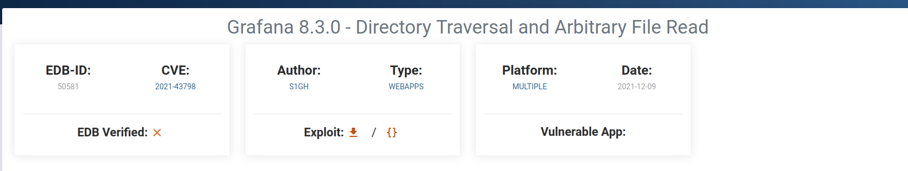

<br>

<br>

### Descripción
* * *
<br>
Aquí detallaremos el proceso de identificación y explotación de vulnerabilidades en una máquina Docker desplegada en un entorno de laboratorio. La máquina presenta múltiples servicios expuestos, incluyendo Grafana, Apache y un servidor FTP, cada uno con sus propias configuraciones y potenciales debilidades de seguridad. Los pasos cubren desde el escaneo de puertos hasta la explotación de servicios específicos y la elevación de privilegios, ofreciendo una visión detallada del enfoque metodológico y las herramientas utilizadas, como Nmap, Hydra y exploits personalizados, en un entorno controlado para fines educativos.

### Enlace de Lab:
[Dockerlabs: Move](https://www.dockerlabs.es/).

### Dificultad:
Fácil.


### Solución
* * *
<br>
Estas máquinas están basadas en Docker y mediante un archivo llamado ´auto_loader.sh´ las montaremos de una forma automática, lo primero que debemos hacer es el siguiente comando:

```shell
./auto_deploy.sh move.tar
```


Observamos que nuestra máquina está corriendo sobre la IP `172.17.0.2`, esto porque al estar en Docker por defecto corren sobre la interfaz 172.17.0.x

Dicho esto, es momento de hacer un escaneo con `nmap`, más que nada para ver con que nos estamos enfrentando.

``` shell
nmap -p- -Pn  -sS --min-rate 5000 --open 172.17.0.2  -oX report.xml -v
```


Donde:

**`-p-`**Esta opción le dice a `nmap` que escanee todos los puertos de 1 a 65535 en el objetivo.
    
**`-Pn`**: Esta opción omite el descubrimiento de hosts.
    
**`-sS`**Realiza un escaneo SYN. Este es un tipo de escaneo sigiloso que es menos probable que sea registrado por sistemas de detección de intrusos.
    
**`--min-rate 5000`**Esta opción configura `nmap` para enviar paquetes a una tasa mínima de 5000 paquetes por segundo.
    
**`--open`**: Le indica a `nmap` que sólo muestre los puertos que están abiertos.
 	 
**`-v`**: Aumenta la verbosidad del comando, lo que significa que `nmap` proporcionará más detalles sobre lo que está haciendo.

Obtenemos 3 puertos abiertos, `21 -> ftp` `22 -> ssh`, `80 -> http` y `3000 -> ppp` .

Ahora es momento de ver con qué versiones nos estamos enfrentando de cada servicio. Para ello implementamos el código:

```shell
nmap -sCV -p21,22,80 172.17.0.2 -oN ports_version
```


Donde:

**`-sC`**Esta opción le dice a `nmap` que ejecute scripts predeterminados contra los puertos encontrados.
    
**`-sV`**: Le indica a `nmap` que intente determinar la versión de los servicios que se están ejecutando en los puertos abiertos.

>*sCV es la combinación de ambos comandos*.


Nos arroja una cantidad inmensa de datos

Pero, lo importante a recalcar es que nos percatamos que ocurre algo interesante con el ftp, más específico `ftp-anon: Anonymous FTP login allowed`.

Esto no es más que una característica que, gracias a FTP, sin necesidad de proporcionar contraseña podemos acceder a este servicio con el usuario `anonymous`.

Pues, eso hacemos. Accedemos al ftp con el comando:

```ssh
ftp 172.17.0.2
```

Al momento que nos pida un usuario, escribimos:

`anonymous`


Y perfecto, ya tendríamos acceso. Dentro del directorio si hacemos un `ls` veremos que hay un archivo llamado `database.kdbx`

La descargamos con el comando `get`


La extensión `kdbx` pertenece a keepass. Sabiendo esto podemos usar una herramienta llamada `keepass2john`

```shell
keepass2john database.kdbx
```


Cuando ejecutamos la herramienta, nos fijamos que el método de encriptación aún no es vulnerable, lo que significa que esta no es la vía, y esto no es más que un `rabbit hole`. Debemos buscar otras vías.

Vamos al puerto `http`, es decir a ver el puerto 80. Ejecutamos el `script` de `whatweb` para identificar que se encuentra y a que nos enfrentamos:

```shell
whatweb http://172.17.0.2/
```


En primera instancia, parece que es una instalación por defecto de `Apache` pero, por las dudas, hacemos un `fuzzeo web` para eliminar posibles vías de ataque.

En este caso, utilizaremos la herramienta de `OWASP Dirbuster` la cual cuenta con interfaz gráfica que nos simplifica bastante la tarea. En este caso, utilizaremos el diccionario `directory-list-2-3-medium.txt` y que busque archivos con extensión `php` y `html`. Quedando como la siguiente imagen:


Pasado un tiempo, encontramos un directorio llamado `maintenance.html`


Vemos su contenido el cual nos dice:


Ya tenemos una ruta la cual mirar, una vez ganemos acceso al servidor.

Siguiendo con los puertos que nos quedan, ahora correremos el 3000, que es el único que nos queda por evaluar.

Identificamos que es una web, asi que como ocurrió con el puerto `80` ejecutamos el comando `whatweb` pero ahora en el puerto `3000`:

```shell
whatweb http://172.17.0.2:3000
```


Vemos que estamos con `Grafana 8.3.0` y si accedemos mediante el navegador, vemos lo siguiente


Cualquier usuario y contraseña que ingresamos aquí, será válido y podremos acceder al panel del admin


Pero como no comprendemos exactamente este gestor de contenido, lo ideal sería buscar en internet algún `exploit` que tenga la versión.

Hemos encontrado que esta versión es vulnerable a `Directory traversal` y `Arbitrary File Read`



Nos descargamos el script [^1] y lo ejecutamos con el siguiente comando:

```shell
python3 ./grafana_path_exploit.py -H http://172.17.0.2:3000
```

y al momento que nos diga

`Read File >`

vemos el `/etc/passwd` para ver los usuarios del sistema


y vemos que tenemos a `freddy`


Pondremos la ruta que encontramos en `maintenance.html` de `/tmp/pass.txt`


Ahora es momento de que probemos el usuario `freddy` junto al texto que encontramos en `/tmp/pass.txt`


Ingresamos por `ssh` de la siguiente manera:

```shell
ssh freddy@172.17.0.2
```

Ponemos la contraseña y, efectivamente, ya tenemos acceso al servidor como `fredy`


Ahora es momento de ver qué podemos hacer como `freddy` dentro del servidor. Si ejecutamos un `sudo -l` nos toparemos con lo siguiente:


Es decir, podemos ejecutar `Python 3` en el archivo `/opt/maintenance.py` como `root` sin necesidad de proporcionar contraseña.

Modificamos el contenido para que llame a una `bash` de la siguiente forma:


Y ya seria ejecutar el siguiente comando:

```shell
sudo /usr/bin/python3 /opt/maintenance.py
```


Y ya tendremos acceso `root` y la Máquina estaría comprometida.

[^1]: [Grafana exploit](https://www.exploit-db.com/exploits/50581)
